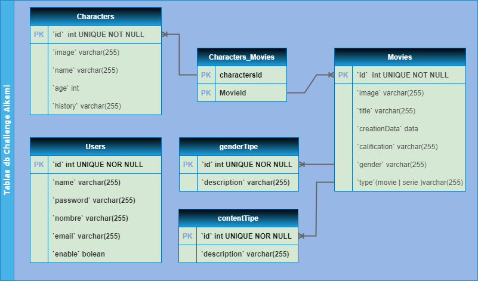

# MERN - Backend Estudio autodidacta

## Api Rest creada en Node.js Express MongoDB Cludinary

### Utilizando Librerias como:

mongoose , Cludinary , cors , dotenv , express-fileupload , fs-extra , http-errors , morgan

## Hosting en servidores de railway:

https://mernbackend-production-c23a.up.railway.app/posts

## Para ser consumida por un frontEnd creado en react / alojado en railway:

https://mernfrontend-production.up.railway.app/

## Base de datos en Servidores cloud.MongoDB.com

https://cloud.mongodb.com/

## Imagenes almacenadas en Cloudinary.com

https://cloudinary.com/

AccesPoint / Access Point
Puntos de acceso / Rutas
GET de todos los datos de la api

### GET's -> https://mernbackend-production-c23a.up.railway.app/posts

GET de una tarea en particular

### https://mernbackend-production-c23a.up.railway.app/posts/:id

DELETE, POST, PUT

### https://mernbackend-production-c23a.up.railway.app/posts/:id

Nodejs & Express - Desarrollo Backend por alekusa,
en estudio del backend como autodidacta .!
gracias a Fazt y su canal en youtube /
https://www.youtube.com/@FaztCode
